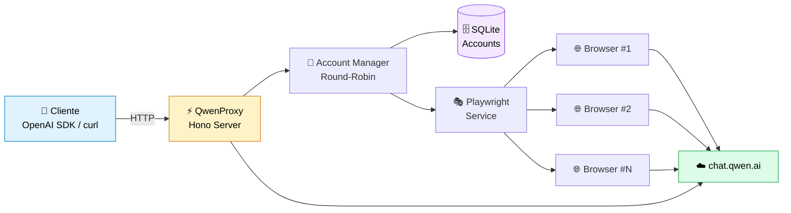

<div align="center">

<!-- Animated Header -->
<h1>
  
  QwenProxy
</h1>

<p>
  
</p>

<p align="center">
  <strong>Use os modelos do Qwen como se fossem a API oficial da OpenAI — sem chaves, sem limites artificiais.</strong>
</p>

<!-- Badges -->
<p align="center">
  <a href="https://github.com/pedrofariasx/qwenproxy/actions/workflows/ci.yml">
    
  </a>
  
  
  
  
  
  
</p>

<!-- Quick Links -->
<p align="center">
  <a href="#-instalação-em-30-segundos"><strong>🚀 Quick Start</strong></a> •
  <a href="#-features"><strong>✨ Features</strong></a> •
  <a href="#-arquitetura"><strong>🏗️ Arquitetura</strong></a> •
  <a href="#-uso"><strong>📖 Uso</strong></a> •
  <a href="#-exemplos-de-integração"><strong>🔌 Integração</strong></a> •
  <a href="#-troubleshooting"><strong>🆘 Ajuda</strong></a>
</p>

</div>

---

## 🎯 O que é?

O **QwenProxy** é um servidor local que simula a API da OpenAI (`/v1/chat/completions`) mas roteia as requisições para os modelos do [Qwen](https://chat.qwen.ai) através de automação de navegador. Em outras palavras:

```
┌─────────────────┐         ┌──────────────┐         ┌──────────────┐
│  Seu código     │  OpenAI │  QwenProxy   │  Qwen   │  chat.qwen   │
│  (OpenAI SDK)   │ ──────► │  (localhost) │ ──────► │  .ai         │
└─────────────────┘   API   └──────────────┘         └──────────────┘
```

**Resultado:** Use qualquer SDK, lib ou ferramenta compatível com OpenAI para acessar Qwen — com suporte a múltiplas contas, streaming, reasoning, tools e uploads multimodais.

---

## ✨ Features

<table>
  <tr>
    <td width="50%">
      <h3>🔌 Compatível com OpenAI</h3>
      <p>Endpoints <code>/v1/chat/completions</code>, <code>/v1/models</code> e <code>/v1/upload</code> 100% compatíveis com a API oficial.</p>
    </td>
    <td width="50%">
      <h3>👥 Multi-Account</h3>
      <p>Gerencie várias contas Qwen com rotação <strong>round-robin</strong> e cooldown automático — evite rate limits.</p>
    </td>
  </tr>
  <tr>
    <td>
      <h3>🎭 Guest Mode</h3>
      <p>Use sem login via API pública do Qwen. Perfeito para testes rápidos.</p>
    </td>
    <td>
      <h3>🧠 Reasoning</h3>
      <p>Suporte completo ao modo de pensamento (thinking) dos modelos Qwen-Max, Qwen-Plus e QwQ.</p>
    </td>
  </tr>
  <tr>
    <td>
      <h3>🔧 Tool Execution</h3>
      <p>Sistema de execução de ferramentas locais integrado ao fluxo do chat — defina suas próprias tools.</p>
    </td>
    <td>
      <h3>📎 Multimodal Upload</h3>
      <p>Envio de imagens, vídeos, áudios e documentos via <code>/v1/upload</code> integrado ao OSS do Qwen.</p>
    </td>
  </tr>
  <tr>
    <td>
      <h3>💾 SQLite Storage</h3>
      <p>Contas persistidas em SQLite (WAL mode) para performance e confiabilidade — nunca perca suas sessões.</p>
    </td>
    <td>
      <h3>🔒 Session Persistence</h3>
      <p>Perfil de navegador persistente por conta em <code>qwen_profiles/</code> com login automático.</p>
    </td>
  </tr>
  <tr>
    <td>
      <h3>📊 Monitoring</h3>
      <p>Health check, métricas Prometheus e watchdog integrados. Observe tudo em tempo real.</p>
    </td>
    <td>
      <h3>🐳 Docker Ready</h3>
      <p>Deploy para VPS em segundos com Docker, volumes persistentes e graceful shutdown.</p>
    </td>
  </tr>
</table>

---

## 🏗️ Arquitetura



### 🔄 Fluxo de uma requisição

1. **Cliente** envia POST para `/v1/chat/completions` com payload OpenAI
2. **QwenProxy** valida o payload e pede uma conta ao **Account Manager**
3. **Account Manager** seleciona a próxima conta disponível (round-robin + cooldown)
4. **Playwright** usa o navegador da conta selecionada para autenticar e enviar a requisição ao Qwen
5. **Stream Bridge** captura a resposta SSE do Qwen e converte para formato OpenAI
6. **Cliente** recebe a resposta como se viesse da OpenAI

---

## 🚀 Instalação em 30 segundos

### Via npm (global)

```bash
npm install -g @pedrofariasx/qwenproxy
npx playwright install
qwenproxy
```

### Via clone

```bash
git clone https://github.com/pedrofariasx/qwenproxy.git
cd qwenproxy
npm install
npx playwright install
npm start
```

### Via Docker

```bash
docker-compose up -d
```

### Pré-requisitos

| Dependência | Versão | Como instalar |
|:-----------:|:------:|:--------------|
| 📦 Node.js | `v20+` | [nvm.sh](https://github.com/nvm-sh/nvm) ou [nvm-windows](https://github.com/coreybutler/nvm-windows) |
| 🎭 Playwright | latest | `npx playwright install` |
| 🐳 Docker *(opcional)* | `v24+` | [docker.com](https://docs.docker.com/get-docker/) |

---

## ⚙️ Configuração

Crie um arquivo `.env` na raiz (baseado no `.env.example`):

```env
# ==================== SERVIDOR ====================
PORT=3000                          # Porta do servidor
HOST=0.0.0.0                       # Host (0.0.0.0 = todas as interfaces)
API_KEY=sua-chave-secreta          # (Opcional) Protege seus endpoints

# ==================== QWEN ========================
QWEN_EMAIL=seu@email.com           # Login automático (single-account)
QWEN_PASSWORD=sua-senha
QWEN_GUEST_MODE_ONLY=false         # true = usa API pública, sem login

# ==================== BROWSER =====================
BROWSER=chromium                   # chromium | firefox | chrome | edge | webkit
HEADLESS=true                      # true = sem interface gráfica

# ==================== TIMEOUTS ====================
NAVIGATION_TIMEOUT=45000           # Tempo máximo de navegação (ms)
PAGE_TIMEOUT=30000                 # Timeout por página
HTTP_TIMEOUT=30000                 # Timeout HTTP geral
HEADERS_TIMEOUT=60000              # Timeout para headers
CHAT_TIMEOUT=120000                # Timeout do chat
STREAM_IDLE_TIMEOUT=180000         # Idle timeout do streaming
```

> 💡 **Dica:** Para desenvolvimento local, use `HEADLESS=false` para ver o navegador em ação.

---

## 👥 Gerenciamento de Contas

Adicione várias contas para **evitar rate limits** e **aumentar throughput**. O CLI interativo facilita:

```bash
npm run login                 # Abre o menu interativo
npm run login:chrome          # Usando Chrome
npm run login:firefox         # Usando Firefox
npm run login:edge            # Usando Edge
```

### Menu interativo

| Tecla | Ação |
|:-----:|------|
| **A** | Adicionar conta com email + senha |
| **M** | Adicionar conta via login manual no navegador |
| **R** | Remover uma conta |
| **L** | Login em todas as contas (inicializar sessões) |

> ℹ️ Contas antigas em `accounts.json` são migradas automaticamente para SQLite na primeira execução.

---

## 📖 Uso

### Iniciando o servidor

```bash
npm start                  # Chromium (padrão)
npm run start:chrome       # Google Chrome
npm run start:firefox      # Firefox
npm run start:edge         # Microsoft Edge
```

O servidor sobe em **`http://localhost:3000`**.

### Endpoints disponíveis

| Rota | Método | Descrição | Streaming |
|------|:------:|-----------|:---------:|
| `/v1/chat/completions` | `POST` | Chat completions completo | ✅ |
| `/v1/chat/completions/stop` | `POST` | Abortar uma geração ativa | — |
| `/v1/models` | `GET` | Listar modelos disponíveis | — |
| `/v1/models/:model` | `GET` | Informações de um modelo | — |
| `/v1/upload` | `POST` | Upload multimodal (img/video/audio/doc) | — |
| `/health` | `GET` | Health check do sistema | — |
| `/metrics` | `GET` | Métricas Prometheus | — |

---

## 🔌 Exemplos de Integração

### JavaScript / TypeScript (OpenAI SDK)

```typescript
import OpenAI from 'openai';

const openai = new OpenAI({
  baseURL: 'http://localhost:3000/v1',
  apiKey: process.env.API_KEY || 'sk-no-key-required'
});

// Simples
const completion = await openai.chat.completions.create({
  model: 'qwen-plus',
  messages: [{ role: 'user', content: 'Olá, Qwen!' }]
});
console.log(completion.choices[0].message.content);

// Streaming
const stream = await openai.chat.completions.create({
  model: 'qwen-plus',
  messages: [{ role: 'user', content: 'Me conte uma história' }],
  stream: true
});
for await (const chunk of stream) {
  process.stdout.write(chunk.choices[0]?.delta?.content || '');
}
```

### Python

```python
from openai import OpenAI

client = OpenAI(
    base_url="http://localhost:3000/v1",
    api_key="sk-no-key-required"
)

response = client.chat.completions.create(
    model="qwen-plus",
    messages=[{"role": "user", "content": "Olá!"}],
    stream=True
)

for chunk in response:
    print(chunk.choices[0].delta.content or "", end="")
```

### cURL

```bash
curl http://localhost:3000/v1/chat/completions \
  -H "Content-Type: application/json" \
  -H "Authorization: Bearer sua-chave" \
  -d '{
    "model": "qwen-plus",
    "messages": [{"role": "user", "content": "Hello!"}],
    "stream": true
  }'
```

### Com outras ferramentas

Qualquer ferramenta compatível com OpenAI funciona — basta apontar a `baseURL`:

- **LangChain** → `ChatOpenAI(base_url="http://localhost:3000/v1")`
- **LlamaIndex** → `OpenAI(api_base="http://localhost:3000/v1")`
- **Continue.dev** → configurar endpoint customizado
- **SillyTavern** → adicionar como API customizada

---

## 🐳 Deploy com Docker

### `docker-compose.yml`

```yaml
services:
  qwenproxy:
    build: .
    container_name: qwenproxy
    ports:
      - "${PORT:-3000}:3000"
    env_file:
      - .env
    volumes:
      - qwenproxy_data:/app/data
      - qwenproxy_profiles:/app/qwen_profiles
    restart: unless-stopped
    logging:
      driver: "json-file"
      options:
        max-size: "10m"
        max-file: "3"

volumes:
  qwenproxy_data:       # SQLite com contas
  qwenproxy_profiles:   # Perfis de navegador
```

```bash
docker-compose up -d           # Sobe em background
docker-compose logs -f         # Ver logs
docker-compose down            # Parar
```

> ⚠️ Se usar bind mounts locais em vez de volumes nomeados, garanta que os diretórios sejam graváveis pelo container.

---

## 📁 Estrutura do Projeto

<details>
<summary><strong>Clique para expandir a árvore completa</strong></summary>

```
qwenproxy/
├── bin/
│   └── qwenproxy.mjs              # Entry point do CLI binário
├── src/
│   ├── index.ts                   # Entry point do servidor
│   ├── login.ts                   # CLI de gerenciamento de contas
│   ├── api/
│   │   ├── models.ts              # Endpoints /v1/models
│   │   └── server.ts              # Servidor Hono + startup
│   ├── cache/
│   │   └── memory-cache.ts        # Cache em memória com TTL
│   ├── core/
│   │   ├── account-manager.ts     # Rotação round-robin + cooldowns
│   │   ├── accounts.ts            # CRUD de contas (SQLite)
│   │   ├── config.ts              # Configuração com Zod
│   │   ├── crypto-utils.ts        # Criptografia de senhas em repouso
│   │   ├── database.ts            # Conexão e migrations SQLite
│   │   ├── logger.ts              # Logger estruturado
│   │   ├── metrics.ts             # Coleta de métricas Prometheus
│   │   ├── model-registry.ts      # Registro de modelos e context windows
│   │   ├── stream-registry.ts     # Tracking de streams ativos
│   │   └── watchdog.ts            # Health monitoring
│   ├── routes/
│   │   ├── chat.ts                # Handler /v1/chat/completions
│   │   ├── sse-parser.ts          # Parser incremental de SSE + delta
│   │   ├── stream-handler.ts      # Orquestração de streaming SSE
│   │   ├── tool-handler.ts        # Execução de tools locais
│   │   └── upload.ts              # Handler /v1/upload (multimodal)
│   ├── services/
│   │   ├── browser-manager.ts     # Ciclo de vida de browsers/contexts
│   │   ├── error-handler.ts       # Tipagem e retry de erros Qwen
│   │   ├── header-interceptor.ts  # Captura de cookies/headers via CDP
│   │   ├── playwright.ts          # Fachada do serviço Playwright
│   │   ├── qwen.ts                # Integração com API do Qwen
│   │   ├── stealth.ts             # Script anti-detecção
│   │   ├── stream-bridge.ts       # Ponte de stream browser → Node
│   │   ├── stream-creator.ts      # Criação de chats e streams Qwen
│   │   └── warm-pool.ts           # Pool de chats pré-aquecidos
│   ├── tests/                     # Testes automatizados (node:test)
│   ├── tools/
│   │   ├── parser.ts              # Parser de  tags
│   │   ├── registry.ts            # Registro de tools
│   │   ├── schema.ts              # Validação JSON Schema
│   │   └── types.ts               # Tipos do sistema de tools
│   └── utils/
│       ├── context-truncation.ts  # Truncamento de contexto
│       ├── json.ts                # Parser JSON robusto
│       ├── qwen-stream-parser.ts  # Parser de streams SSE do Qwen
│       └── types.ts               # Re-exports de tipos
├── data/                          # Banco SQLite (gitignored)
├── qwen_profiles/                 # Perfis de navegador por conta
├── Dockerfile
├── docker-compose.yml
├── tsconfig.json
├── tsconfig.build.json
└── package.json
```

</details>

---

## 🆘 Troubleshooting

<details>
<summary><strong>❌ Porta 3000 já está em uso</strong></summary>

Altere a porta no `.env`:
```env
PORT=3001
```
Ou encerre o processo:
```bash
# Linux/Mac
lsof -ti:3000 | xargs kill -9

# Windows PowerShell
Get-NetTCPConnection -LocalPort 3000 | ForEach-Object { Stop-Process -Id $_.OwningProcess -Force }
```

</details>

<details>
<summary><strong>❌ Navegador não abre / erro de browser</strong></summary>

Reinstale os browsers do Playwright:
```bash
npx playwright install
# Ou browsers específicos:
npx playwright install chromium firefox
```

</details>

<details>
<summary><strong>❌ Sessão expirada / 401 Unauthorized</strong></summary>

Renove os cookies de todas as contas:
```bash
npm run login
# Selecione [L] Login em todas as contas
```

</details>

<details>
<summary><strong>❌ Rate limit em todas as contas</strong></summary>

Adicione mais contas:
```bash
npm run login
# Selecione [A] ou [M] para adicionar
```
O sistema faz rotação automática entre as contas disponíveis.

</details>

<details>
<summary><strong>❌ Banco de dados corrompido</strong></summary>

```bash
# Remova o banco antigo
rm data/qwenproxy.db

# Re-adicione suas contas
npm run login
```

</details>

<details>
<summary><strong>❌ Docker: permissão negada nos volumes</strong></summary>

Garanta que os volumes estão com as permissões corretas:
```bash
docker-compose down
docker volume rm qwenproxy_qwenproxy_data qwenproxy_qwenproxy_profiles
docker-compose up -d
```

</details>

---

## 🤝 Contribuindo

Contribuições são bem-vindas! Sinta-se à vontade para:

- 🐛 Reportar bugs em [Issues](https://github.com/pedrofariasx/qwenproxy/issues)
- 💡 Sugerir features
- 🔧 Enviar Pull Requests

---

## 📄 Licença

Este projeto está licenciado sob a **ISC License** — veja o arquivo [LICENSE](LICENSE) para detalhes.

---

## ⚠️ Disclaimer

> **Este projeto é fornecido estritamente para fins educacionais e de pesquisa.**

Os autores não incentivam ou endossam:
- ❌ Violação dos Termos de Serviço da plataforma Qwen
- ❌ Automação não autorizada em larga escala
- ❌ Uso para atividades maliciosas

**Use por sua conta e risco.**

---

<div align="center">

**⭐ Se este projeto te ajudou, considere dar uma estrela no GitHub!**

<sub>Feito com ❤️ pela comunidade open-source</sub>

</div>
